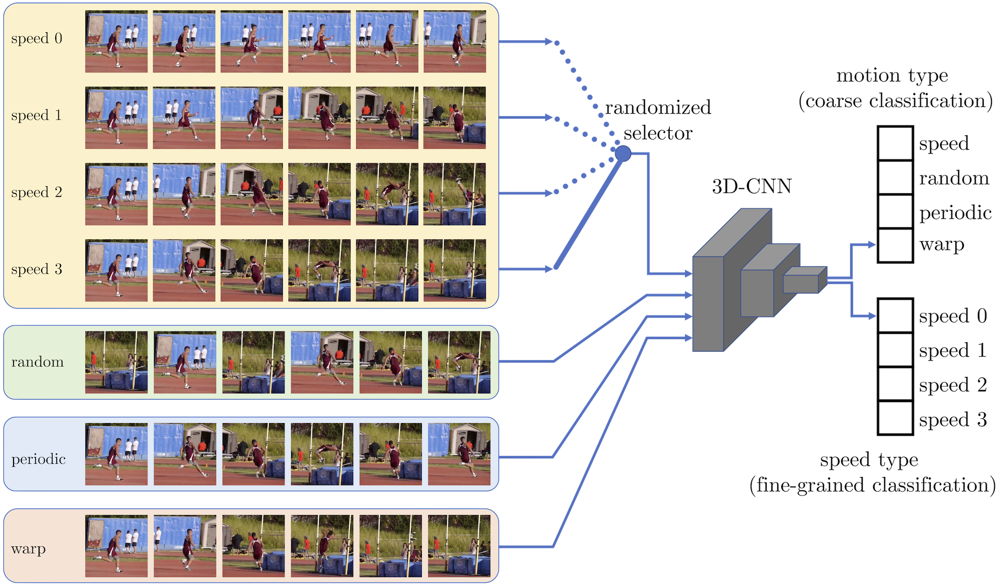

  <a href="https://sjenni.github.io" style="font-size: 21px; text-decoration: none">Simon Jenni</a> 
  &nbsp; &nbsp; &nbsp; &nbsp; &nbsp; &nbsp; &nbsp;  
  <a href="https://gmeishvili.github.io" style="font-size: 21px; text-decoration: none">Givi Meishvili</a> 
  &nbsp; &nbsp; &nbsp; &nbsp; &nbsp; &nbsp; &nbsp;  
  <a href="http://www.cvg.unibe.ch/people/favaro" style="font-size: 21px; text-decoration: none">Paolo Favaro</a>

  <a href="" style="font-size: 21px; text-decoration: none">[Arxiv]</a>
  &nbsp; &nbsp; &nbsp; &nbsp; &nbsp; &nbsp; &nbsp;  
  <a href="https://github.com/sjenni/temporal-ssl" style="font-size: 21px; text-decoration: none">[GitHub]</a> 

    

***Training a 3D-CNN to distinguish temporal transformations.*** *In each mini-batch we select a video speed (out of 4 possible choices), i.e., how many frames are skipped in the original video. Then, the 3D-CNN receives as input mini-batch a mixture of 4 possible transformed sequences. One is the original sequence at the selected speed (speed 3 in the illustration). Another one is a random  permutation  of  the  sequence;  a  third  one  is  obtained  by  substituting the  second  half  of  the  sequence  with  the  first  in  inverted  order  and  also  with different frames to avoid symmetries; the fourth one is obtained by sampling the frames around those of the chosen speed.*

___

# Abstract

We introduce a novel principle for self-supervised feature learning based on the discrimination of specific transformations of an image. 
We argue that the generalization capability of learned features depends on what image neighborhood size is sufficient to discriminate different image transformations: The larger the required neighborhood size and the more global the image statistics that the feature can describe. An accurate description of global image statistics allows to better represent the shape and configuration of objects and their context, which ultimately generalizes better to new tasks such as object classification and detection.
This suggests a criterion to choose and design image transformations. 
Based on this criterion, we introduce a novel image transformation that we call limited context inpainting (LCI).
This transformation inpaints an image patch conditioned only on a small rectangular pixel boundary (the limited context). Because of the limited boundary information, the inpainter can learn to match local pixel statistics, but is unlikely to match the global statistics of the image.
We claim that the same principle can be used to justify the performance of transformations such as image rotations and warping.
Indeed, we demonstrate experimentally that learning to discriminate transformations such as LCI, image warping and rotations, yields features with state of the art generalization capabilities on several datasets such as Pascal VOC, STL-10, CelebA, and ImageNet. Remarkably, our trained features achieve a performance on Places on par with features trained through supervised learning with ImageNet labels